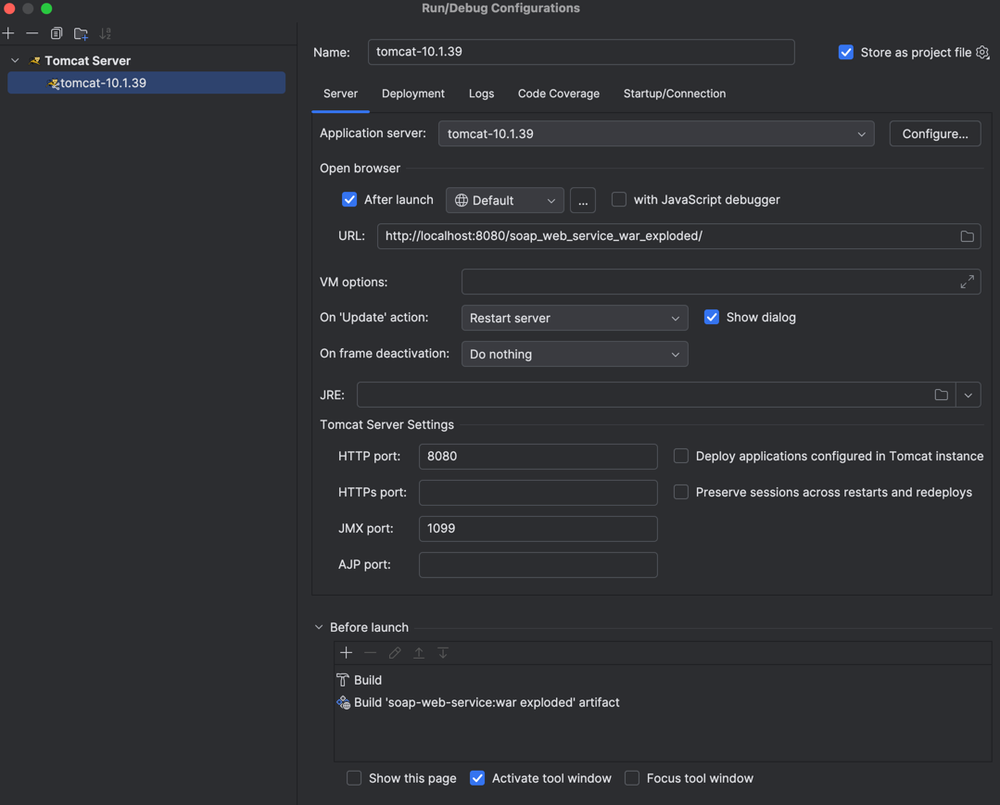

# soap-web-service
### SOAP (Simple Object Access Protocol) web services provide a standardized way for applications to communicate over the web.
This is a simple calculator service that adds and subtract two numbers to illustrate the process of creating a SOAP web service in IntelliJ IDEA using Jakarta EE and deploying it on the Apache Tomcat server.

### WSDL (Web Services Description Language) file:
`http://localhost:8080/soap_web_service_war_exploded/calculatorWebService?WSDL`

### XSD (XML Schema Definition) file:
`http://localhost:8080/soap_web_service_war_exploded/calculatorWebService?xsd=1`

### Server config:

Inspired by [create-soap-web-service](https://medium.com/@dharshithasrimal/create-a-soap-web-service-a-step-by-step-tutorial-7b16a0ff8bf4) tutorial.

